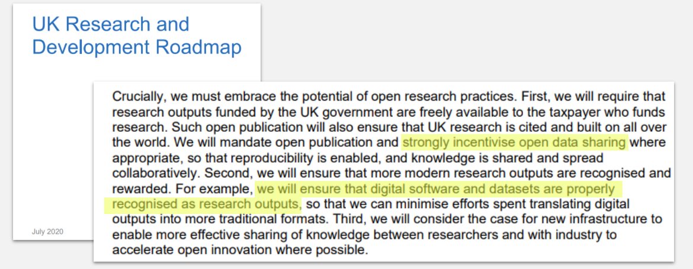
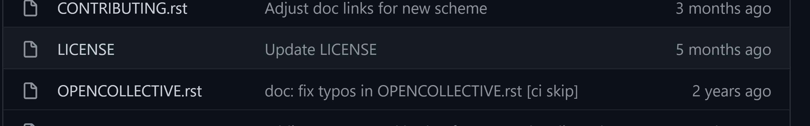
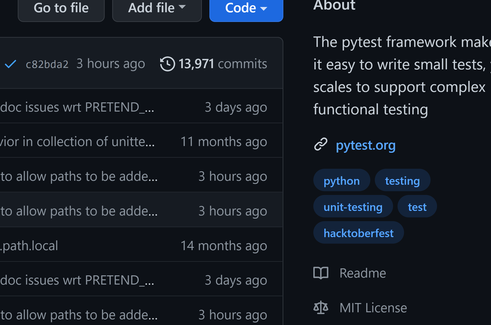

---
title: Licensing your code for better impact
date: March 2022
slideNumber: true
...

# Status of these slides

<style> .reveal h1 { font-size: 2em; } </style>

> This is work in progress software engineering advice, and has not been checked by a legal expert. **Feedback welcome!**

# Hi, I'm [Bob](https://rse.shef.ac.uk/contact/bob-turner/)!

Career...
Software Consultant -> Researcher -> Research Software Engineer

<!--This can be modified for individual presenters-->

# RSE at Sheffield

{ height=256px }

13 RSEs, 35 projects / year worth ~£11m total

# Operational Model

- Underwritten by overheads
- Funded from external sources

# Operational Model: Results

- Financial sustainability
- “Fair” allocation of staff to projects
- “Convenient” access to growing pool of expertise and experience
- (Mainly) academic led
- Open ended contracts for RSEs

# Talk Structure


# Copyright

- Copyright is a type of intellectual property, particularly relevant to software.
- [Berne Convention](https://en.wikipedia.org/wiki/Berne_Convention) of 1886: Copyright is immediately bestowed upon a work the moment it is created, without requiring any registration.

# Who owns the copyright on my code?

> If you're a University of Sheffield researcher, probably **not** you!

- Staff or research students - usually the university ([student IP](https://www.sheffield.ac.uk/research-services/commercialisation/student-ip), [UK gov](https://www.legislation.gov.uk/ukpga/1988/48/section/11).)
- Different rules for undergrads.
- Funded research can have specific agreements in place - check with your PI, or your funding agreements.

# License

Gives right to use copyright material in specific ways, without changing ownership.

No license : no **right** to copy.

# In a nutshell



# Open Source Benefits

- Reproducibility is easier
- Faster impact
- More eyes, less bugs
- Access for everyone, regardless of ability to pay
- Encouraged by UK Government

# FAIR Principles

> ...the existing digital ecosystem surrounding scholarly data publication prevents us from extracting maximum benefit from our research investments...

[The FAIR Guiding Principles for scientific data management and stewardship](https://www.nature.com/articles/sdata201618)

**Findability**, **Accessibility**, **Interoperability**, and **Reuse**

[FAIR4RS](https://arxiv.org/ftp/arxiv/papers/2101/2101.10883.pdf), [Four freedoms (abridged)](https://www.gnu.org/philosophy/free-sw.en.html)

# National Policy



[https://www.gov.uk/government/publications/uk-research-and-development-roadmap](https://www.gov.uk/government/publications/uk-research-and-development-roadmap)

[OGL 3](https://www.nationalarchives.gov.uk/doc/open-government-licence/version/3/)

# Open Source Drawbacks

- Getting "scooped"
- Being exposed as a bad programmer
- Misuse (building weapons, rigging elections)
- Sustainability (Who updates the code? Who pays for this?)

> Software is not "just" data. It **needs** to be updated to remain useful. [Here's the code for Space Invaders](https://computerarcheology.com/Arcade/SpaceInvaders/Code.html).

# Open Source Case Study: [GPy](https://github.com/SheffieldML/GPy)

- AI package (anecdotally) used in financial services, public health modelling.
- [2.9 million downloads on PyPi](https://pepy.tech/project/gpy)
- [1.7k stars on GitHub](https://github.com/SheffieldML/GPy)
- No maintainers!

# Open Source Case Study: [GateNLP](https://github.com/GateNLP)

- "Natural Language Processing" (AI text analysis)
- [Impact case study (2014)](https://impact.ref.ac.uk/casestudies/CaseStudy.aspx?Id=9439)
- Used in media (delivery; analysis; journalism); pharmaceuticals; patent search; voice-of-the-customer; brand, product, and reputation management; social media analytics; bioinformatics.
- Commercial beneficiaries include BT, Elsevier, Yahoo, Atos, Dassault Aviation, MPS Bank, Creditreform, BBC, the Press Association, Euromoney.

# Closed Source Benefits

- May increase the value of closed source licences, or products derived from the software.
- Resulting revenue might fund:
  - Sustainability and maintenance
  - Further research and development
  - Regulatory compliance
  - Support
  - Your yacht (😂 - but you may benefit financially)

# The World Needs Closed Source

- Open source tends to have more difficult user experiences (contrast MacOS and Linux on user devices).
- This comes from understanding the market and the end user.
- Which comes from market and user research, paid for by software licencing revenue.

# Software Licensing Income

- Over the last six years of available data the **University of Sheffield** made about **£300,000** in software licensing income per year.
- The **University of Cambridge** made the most in the UK at **£1.5 million** per year.
- Total research income for these two institutions were around **£175 million** and **£527 million** per year, respectively.

[Software licencing income summary](https://rse.shef.ac.uk/soft_income/)

# Closed Source Drawbacks

- Reproducibility is harder, perhaps impossible
- Transparency / openness is reduced
- Trust in research outputs is reduced

# Closed Source Case Study: [Fluent](https://www.nafems.org/blog/posts/analysis-origins-fluent/)

- Computational Fluid Dynamics (CFD) models liquid and air flows and is now considered essential to many aspects of engineering
- Code developed in 1970s
- Licensing in early 1980s
- Part of the basis for market leader [ANSYS Fluent](https://www.ansys.com/en-gb/products/fluids/ansys-fluent)

# Closed Source Case Study: 


# How to open source

::: incremental

- Choose a licence, agreed by everyone on the project.
- Put the licence text in a file alongside your code.
- Publish your code somewhere such as GitHub or GitLab.
- *Release a package.*
- *Reference specific versions using [ORDA](https://orda.shef.ac.uk/), [Zenodo](https://zenodo.org/) or equivalent.*

:::

# Choose a license

:::::::::::::: {.columns}
::: {.column width="50%"}
**"Copyleft"** e.g. [GPL3](https://choosealicense.com/licenses/gpl-3.0/) - better for academic collaboration
:::
::: {.column width="50%"}
**More permissive** e.g. [MIT](https://choosealicense.com/licenses/mit/) - better for private sector collaboration
:::
::::::::::::::

[choosealicence.com](https://choosealicense.com/)

*Presenter follow links.*

# Creative Commons?

::: incremental

- No recommended:
  - Lack software specific terms
  - License compatibility problems

:::

[https://creativecommons.org/faq/#can-i-apply-a-creative-commons-license-to-software](https://creativecommons.org/faq/#can-i-apply-a-creative-commons-license-to-software)

# Apply the licence



- Most licenses require a single file like `LICENSE` or `LICENSE.txt`.
- Some licences advise that you should put a message at the top of every file.

# Publish

{ height=512px }

# Compendia?

```

├───Data
├───Code
└───Docs
```

License individually.

# Even FAIRer?

{ height=512px }

<!--
graph TD
    A[GitHub] -->|Webhook or action| B(Package Index - PyPI, CRAN, ...)
    A -->|Webhook or action| C(Archive - ORDA, Zenodo, ...)
-->

# University of Sheffield advice

- [Research Software Engineering team **Code Clinic**](https://rse.shef.ac.uk/)
- [Library, Research Data Management](https://www.sheffield.ac.uk/library/rdm)
- [University of Sheffield Commercialisation](https://www.sheffield.ac.uk/research-services/commercialisation)

# Thank you